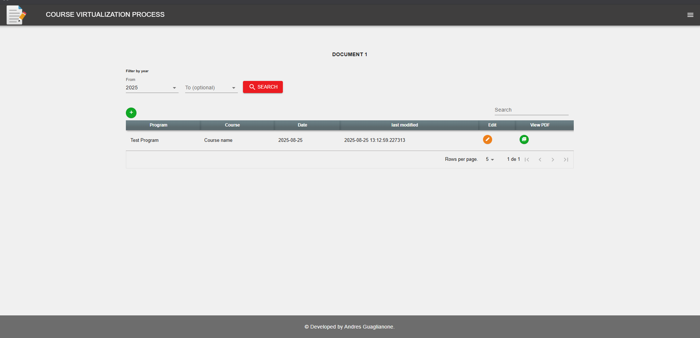
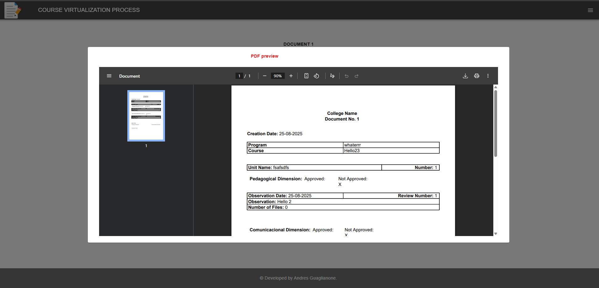

# CVP (Course Virtualization Process) – Demo

A demo full-stack document management app built with React, Symfony (PHP), PostgreSQL, and Docker.

## Features

- Responsive, cross-device UI
- Frontend and backend integration
- Demo-ready with sample configuration

## Tech Stack
- **Frontend:** React (JSX, Webpack)
- **Backend:** Symfony (PHP)
- **Database:** PostgreSQL (Dockerized)
- **Containerization:** Docker + docker-compose

## Setup
```bash
git clone
cd cvp
# adjust .env

#Then do:

# Option 1: Run locally without Docker
# Start Symfony server
symfony server:start
# Start frontend
npm run dev   # or npm run watch

# Option 2: Run with Docker
docker-compose up -d --build

```

## Project Name

Visit [http://localhost:8080](http://localhost:8080) (adjust if needed).

⚠️ **Note:** Default DB credentials and app secrets are for demo use only. Change before production.

## Environment

- `.env.test` contain sample configuration.
- Supports multiple environments: `dev`, `test`, `prod`.

## Usage

1. Start Symfony server  
2. Start React server  
3. Start using the app

## Screenshots




## Notes

- No tests included (this is a stripped-down demo).
- Webpack Encore integration can be enabled if preferred.

## Author

Andres Guaglianone
